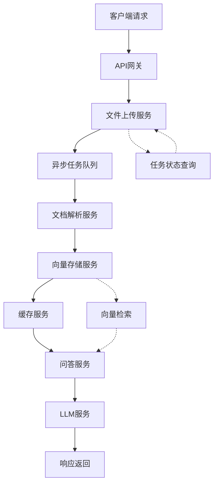

# QMS-Nexus 集成测试计划与策略文档

## 📋 文档信息
- **文档版本**: v1.0
- **创建日期**: 2024年
- **维护团队**: QA架构组
- **适用范围**: QMS-Nexus项目全生命周期测试
- **评审状态**: 待评审

---

## 🎯 1. 测试目标与范围

### 1.1 总体测试目标
基于QMS-Nexus-Architect技能规范，建立覆盖全链路闭环、数据一致性、业务逻辑解耦、异常鲁棒性的完整测试体系，确保系统从文件上传到最终问答的完整RAG链路质量。

### 1.2 核心测试原则
1. **全链路闭环**: 验证端到端业务流程完整性
2. **数据一致性**: 确保多组件间数据状态同步
3. **业务逻辑解耦**: 验证模块化架构的独立性
4. **异常鲁棒性**: 确保系统在异常情况下的稳定性

### 1.3 测试范围定义

#### 1.3.1 包含范围
- ✅ **API接口层**: `/upload`, `/search`, `/ask`, `/health`, `/metrics`
- ✅ **业务逻辑层**: RAGService, DocumentService, PromptService
- ✅ **数据存储层**: ChromaDB向量库, SQLite业务库, Redis缓存
- ✅ **外部集成**: LLM服务, 文件解析, 向量嵌入
- ✅ **监控体系**: Prometheus指标, Grafana可视化

#### 1.3.2 排除范围
- ❌ 前端UI测试 (由前端团队负责)
- ❌ 单元测试 (已单独覆盖)
- ❌ 性能压测 (由性能团队负责)
- ❌ 安全渗透 (由安全团队负责)

---

## 🔄 2. 全链路闭环测试策略

### 2.1 链路定义与分解



### 2.2 闭环验证策略

#### 2.2.1 正向链路验证
| 测试阶段 | 验证点 | 测试策略 | 成功标准 |
|----------|--------|----------|----------|
| **文件上传** | 请求→响应完整性 | 边界值+等价类 | 200状态+任务ID |
| **异步处理** | 任务状态转换 | 状态轮询机制 | Pending→Processing→Completed |
| **文档解析** | 内容提取准确性 | 多格式验证 | 文本+元数据完整 |
| **向量存储** | 嵌入+索引正确性 | 相似度搜索验证 | top_k结果相关性 |
| **问答生成** | 上下文+回答质量 | 多场景提问 | 来源标注+回答准确性 |

#### 2.2.2 反向链路验证
- **失败回滚**: 任意环节失败时的状态回滚
- **补偿机制**: 部分失败时的数据补偿
- **最终一致性**: 异步处理的数据一致性保证
- **超时处理**: 各环节的超时机制验证

### 2.3 关键链路测试用例

#### TC-LINK-001: 完整成功链路
```python
def test_complete_success_chain(self):
    """验证从文件上传到问答的完整成功链路"""
    # 1. 上传PDF文件
    task_id = self.upload_pdf_file("test_qms.pdf")
    
    # 2. 轮询任务状态至完成
    final_status = self.poll_task_to_completion(task_id, timeout=120)
    assert final_status == "Completed"
    
    # 3. 验证向量存储数据
    search_results = self.search_documents("质量管理体系")
    assert len(search_results) > 0
    assert "test_qms.pdf" in search_results[0]["source"]
    
    # 4. 验证问答功能
    answer, sources = self.ask_question("什么是质量方针？")
    assert "质量方针" in answer
    assert len(sources) > 0
    
    # 5. 验证监控指标
    metrics = self.get_prometheus_metrics()
    assert "qms_upload_total" in metrics
    assert "qms_search_total" in metrics
```

#### TC-LINK-002: 链路中断恢复
```python
def test_chain_interruption_recovery(self):
    """验证链路中断后的恢复机制"""
    # 1. 模拟Redis服务中断
    with self.simulate_redis_failure():
        task_id = self.upload_pdf_file("test.pdf")
        # 任务应保持在Pending状态
        assert self.get_task_status(task_id) == "Pending"
    
    # 2. 恢复Redis服务
    self.restore_redis_service()
    
    # 3. 验证任务继续处理
    final_status = self.poll_task_to_completion(task_id, timeout=60)
    assert final_status == "Completed"
    
    # 4. 验证数据完整性
    search_results = self.search_documents("测试内容")
    assert len(search_results) > 0
```

---

## 🔄 3. 数据一致性测试策略

### 3.1 一致性模型定义

#### 3.1.1 强一致性场景
- **任务状态**: 用户查询的状态必须反映真实处理状态
- **文件元数据**: 文件名、大小、类型信息必须准确
- **权限控制**: 访问权限验证必须实时有效

#### 3.1.2 最终一致性场景
- **向量索引**: 文档解析完成后，向量索引可异步更新
- **缓存数据**: 问答缓存可在5分钟内保持有效
- **统计数据**: 监控指标可容忍秒级延迟

### 3.2 一致性验证维度

#### 3.2.1 横向一致性 (跨组件)
| 验证维度 | 涉及组件 | 一致性要求 | 测试策略 |
|----------|----------|------------|----------|
| **文件元数据** | API ↔ 数据库 | 100%一致 | 实时校验 |
| **向量数据** | 解析器 ↔ 向量库 | 最终一致 | 延迟验证 |
| **缓存状态** | 缓存 ↔ 数据库 | TTL一致 | 过期检查 |
| **任务状态** | API ↔ Redis | 强一致 | 原子操作 |

#### 3.2.2 纵向一致性 (时间轴)
```
时间轴一致性验证:
T0: 文件上传完成
T1: 任务状态更新 (≤1s)
T2: 文档解析开始 (≤5s)
T3: 向量存储完成 (≤30s)
T4: 缓存更新完成 (≤35s)
T5: 搜索可用 (≤40s)
```

### 3.3 一致性测试用例

#### TC-CONSIST-001: 任务状态一致性
```python
def test_task_status_consistency(self):
    """验证任务状态在各组件间的一致性"""
    # 1. 上传文件并获取任务ID
    task_id = self.upload_pdf_file("consistency_test.pdf")
    
    # 2. 记录各时间点状态
    status_timeline = []
    for i in range(60):  # 监控60秒
        status = self.get_task_status(task_id)
        timestamp = time.time()
        status_timeline.append({"time": timestamp, "status": status})
        
        if status == "Completed":
            break
        time.sleep(1)
    
    # 3. 验证状态转换合法性
    valid_transitions = ["Pending", "Processing", "Completed"]
    actual_transitions = [s["status"] for s in status_timeline]
    
    # 状态只能向前转换，不能回退
    for i in range(1, len(actual_transitions)):
        prev_status = actual_transitions[i-1]
        curr_status = actual_transitions[i]
        
        # 允许相同状态（处理中）或向前转换
        assert curr_status == prev_status or \
               valid_transitions.index(curr_status) > valid_transitions.index(prev_status)
```

#### TC-CONSIST-002: 数据同步一致性
```python
def test_data_synchronization_consistency(self):
    """验证多组件间的数据同步一致性"""
    # 1. 准备测试文档
    test_content = "这是一致性测试专用内容"
    pdf_path = self.create_test_pdf("sync_test.pdf", test_content)
    
    # 2. 上传并等待处理完成
    task_id = self.upload_file(pdf_path)
    self.wait_for_task_completion(task_id)
    
    # 3. 验证各组件数据一致性
    # 3.1 数据库记录
    db_record = self.get_document_from_db(task_id)
    assert db_record is not None
    assert db_record["filename"] == "sync_test.pdf"
    
    # 3.2 向量存储
    vector_results = self.search_in_vector_db("一致性测试")
    assert len(vector_results) > 0
    
    # 3.3 缓存状态
    cached_result = self.get_from_cache(f"doc:{task_id}")
    assert cached_result is not None
    
    # 3.4 数据内容一致性
    db_text = db_record.get("content", "")
    vector_text = vector_results[0].get("text", "")
    
    # 内容应该基本一致（可能有格式差异）
    assert "一致性测试" in db_text
    assert "一致性测试" in vector_text
```

---

## 🧩 4. 业务逻辑解耦测试策略

### 4.1 解耦架构分析

基于QMS-Nexus-Architect规范，系统采用以下解耦策略：

```
解耦层次结构:
┌─────────────────────────────────────┐
│           API 接口层                 │  ← 仅路由转发，无业务逻辑
├─────────────────────────────────────┤
│          Service 层                 │  ← 业务编排，禁止直接DB访问
├─────────────────────────────────────┤
│          Core 层                    │  ← 核心业务逻辑，可独立测试
├─────────────────────────────────────┤
│        Repository 层                │  ← 数据访问抽象
├─────────────────────────────────────┤
│      外部服务集成层                 │  ← LLM、向量库、缓存
└─────────────────────────────────────┘
```

### 4.2 解耦验证原则

#### 4.2.1 接口独立性
- **无业务硬编码**: API层不包含业务语义
- **配置驱动**: 所有业务参数通过config.yaml配置
- **模板化**: 使用Jinja2模板管理提示词

#### 4.2.2 服务独立性
- **单一职责**: 每个服务只负责一个业务领域
- **依赖倒置**: 依赖抽象接口，不依赖具体实现
- **可替换性**: 外部服务可Mock替换

#### 4.2.3 数据独立性
- **领域隔离**: 各服务拥有独立的数据模型
- **接口契约**: 通过DTO进行数据交换
- **状态管理**: 各服务管理自己的状态

### 4.3 解耦测试用例

#### TC-DECOUP-001: API层无业务逻辑
```python
def test_api_layer_no_business_logic(self):
    """验证API层不包含业务逻辑硬编码"""
    
    # 1. 检查API源代码
    api_files = [
        "api/routes/upload.py",
        "api/routes/search.py", 
        "api/routes/tags.py"
    ]
    
    for file_path in api_files:
        with open(file_path, 'r', encoding='utf-8') as f:
            content = f.read()
            
            # 2. 检查是否包含业务关键词
            business_keywords = ["质量", "ISO", "管理", "体系"]
            for keyword in business_keywords:
                assert keyword not in content, f"API文件 {file_path} 包含业务硬编码: {keyword}"
    
    # 3. 验证API只调用Service层
    import ast
    for file_path in api_files:
        with open(file_path, 'r', encoding='utf-8') as f:
            tree = ast.parse(f.read())
            
            # 检查import语句
            for node in ast.walk(tree):
                if isinstance(node, ast.ImportFrom):
                    # API层应该只导入service和core模块
                    allowed_modules = ['services', 'core', 'fastapi', 'pydantic']
                    if node.module and not any(allowed in node.module for allowed in allowed_modules):
                        print(f"警告: {file_path} 导入非允许模块: {node.module}")
```

#### TC-DECOUP-002: Service层依赖抽象
```python
def test_service_layer_dependency_abstraction(self):
    """验证Service层依赖抽象接口而非具体实现"""
    
    # 1. 测试RAGService的依赖注入
    from core.rag_service import RAGService
    from unittest.mock import Mock
    
    # 2. 创建Mock依赖
    mock_llm = Mock()
    mock_llm.chat.return_value = "测试回答"
    
    mock_vector_db = Mock()
    mock_vector_db.similarity_search.return_value = [
        {"text": "测试内容", "source": "test.pdf", "score": 0.9}
    ]
    
    mock_cache = Mock()
    mock_cache.get.return_value = None  # 缓存未命中
    
    # 3. 注入Mock依赖
    rag_service = RAGService()
    rag_service.llm = mock_llm
    rag_service.db = mock_vector_db
    rag_service.cache = mock_cache
    
    # 4. 验证功能正常
    answer, sources = rag_service.answer("测试问题")
    
    assert answer == "测试回答"
    assert len(sources) > 0
    
    # 5. 验证Mock被正确调用
    mock_llm.chat.assert_called_once()
    mock_vector_db.similarity_search.assert_called_once()
```

#### TC-DECOUP-003: 配置驱动业务逻辑
```python
def test_configuration_driven_business_logic(self):
    """验证业务逻辑通过配置驱动，而非硬编码"""
    
    # 1. 检查配置文件存在
    config_files = [
        "config/config.yaml",
        "core/config.py"
    ]
    
    for config_file in config_files:
        assert Path(config_file).exists(), f"配置文件不存在: {config_file}"
    
    # 2. 验证配置加载
    from core.config import settings
    
    # 3. 检查业务相关配置
    business_configs = [
        "COMPANY_NAME",
        "PRODUCT_NAME", 
        "INDUSTRY_TYPE",
        "EMBEDDING_MODEL",
        "CHUNK_SIZE"
    ]
    
    for config_key in business_configs:
        assert hasattr(settings, config_key), f"缺少业务配置: {config_key}"
        config_value = getattr(settings, config_key)
        assert config_value is not None, f"业务配置为空: {config_key}"
    
    # 4. 验证提示词模板
    prompt_template_dir = Path("system_prompts")
    assert prompt_template_dir.exists(), "提示词模板目录不存在"
    
    template_files = list(prompt_template_dir.glob("*.jinja2"))
    assert len(template_files) > 0, "没有找到提示词模板文件"
```

---

## 🛡️ 5. 异常鲁棒性测试策略

### 5.1 异常分类与分级

#### 5.1.1 系统级异常 (P0 - 高优先级)
| 异常类型 | 影响范围 | 处理策略 | 测试重点 |
|----------|----------|----------|----------|
| **Redis连接失败** | 任务队列阻塞 | 降级为内存队列 | 自动重连机制 |
| **ChromaDB异常** | 向量检索失败 | 返回空结果+告警 | 优雅降级 |
| **LLM服务超时** | 问答功能失效 | 返回默认提示 | 超时控制 |
| **磁盘空间不足** | 文件上传失败 | 提前容量检查 | 资源监控 |

#### 5.1.2 应用级异常 (P1 - 中优先级)
| 异常类型 | 影响范围 | 处理策略 | 测试重点 |
|----------|----------|----------|----------|
| **文件格式错误** | 单文件处理失败 | 记录错误+跳过 | 格式验证 |
| **网络超时** | 外部服务调用失败 | 重试机制+熔断 | 重试策略 |
| **权限验证失败** | 用户访问受限 | 返回401+审计日志 | 权限回退 |
| **参数验证失败** | 请求被拒绝 | 返回400+错误详情 | 输入净化 |

#### 5.1.3 业务级异常 (P2 - 低优先级)
| 异常类型 | 影响范围 | 处理策略 | 测试重点 |
|----------|----------|----------|----------|
| **无搜索结果** | 问答质量下降 | 返回默认回答 | 内容提示 |
| **缓存失效** | 性能下降 | 重新计算+更新缓存 | 缓存重建 |
| **并发冲突** | 数据更新失败 | 乐观锁重试 | 冲突解决 |

### 5.2 异常处理架构

```python
# 异常处理层次结构
class QMSException(Exception):
    """基础异常类"""
    def __init__(self, code: str, message: str, details: dict = None):
        self.code = code
        self.message = message
        self.details = details or {}

class SystemException(QMSException):
    """系统级异常"""
    pass

class ApplicationException(QMSException):
    """应用级异常"""  
    pass

class BusinessException(QMSException):
    """业务级异常"""
    pass
```

### 5.3 鲁棒性测试用例

#### TC-ROBUST-001: Redis故障恢复
```python
def test_redis_failure_recovery(self):
    """验证Redis故障的检测与恢复机制"""
    
    # 1. 正常上传文件建立基线
    baseline_task_id = self.upload_pdf_file("baseline.pdf")
    assert self.get_task_status(baseline_task_id) == "Pending"
    
    # 2. 模拟Redis连接失败
    with self.simulate_redis_failure():
        # 3. 尝试新的上传
        failed_task_id = self.upload_pdf_file("during_failure.pdf")
        
        # 4. 验证系统行为
        # 任务应该被接受，但保持Pending状态
        assert self.get_task_status(failed_task_id) == "Pending"
        
        # 5. 验证错误日志
        error_logs = self.get_recent_error_logs()
        redis_errors = [log for log in error_logs if "Redis" in log]
        assert len(redis_errors) > 0, "应该记录Redis连接错误"
    
    # 6. 恢复Redis服务
    self.restore_redis_service()
    
    # 7. 验证自动恢复
    # 之前失败的任务应该继续处理
    final_status = self.poll_task_to_completion(failed_task_id, timeout=60)
    assert final_status == "Completed"
    
    # 8. 验证功能完整性
    search_results = self.search_documents("during_failure")
    assert len(search_results) > 0
```

#### TC-ROBUST-002: LLM服务熔断机制
```python
def test_llm_service_circuit_breaker(self):
    """验证LLM服务的熔断与恢复机制"""
    
    # 1. 模拟LLM服务连续失败
    failure_count = 0
    max_failures = 5
    
    with self.simulate_llm_timeout():
        for i in range(max_failures + 2):  # 超过熔断阈值
            try:
                answer, sources = self.ask_question(f"测试问题{i}")
                # 应该返回默认回答
                assert "知识库中暂无相关记录" in answer
                
            except Exception as e:
                failure_count += 1
                print(f"LLM调用失败 {failure_count}: {e}")
    
    # 2. 验证熔断触发
    assert failure_count >= max_failures, "应该触发熔断机制"
    
    # 3. 验证熔断后快速失败
    start_time = time.time()
    try:
        self.ask_question("熔断后测试")
        fail_time = time.time() - start_time
        assert fail_time < 1, "熔断后应该快速失败"
    except:
        pass  # 期望失败
    
    # 4. 恢复LLM服务
    self.restore_llm_service()
    
    # 5. 验证熔断恢复
    time.sleep(10)  # 等待熔断恢复窗口
    
    answer, sources = self.ask_question("恢复后测试")
    assert "恢复后测试" not in answer  # 应该获得正常回答
    assert len(sources) > 0
```

#### TC-ROBUST-003: 并发异常处理
```python
def test_concurrent_exception_handling(self):
    """验证高并发场景下的异常处理能力"""
    
    import threading
    import concurrent.futures
    
    # 1. 定义并发测试函数
    def concurrent_upload(index):
        try:
            task_id = self.upload_pdf_file(f"concurrent_{index}.pdf")
            return {"index": index, "task_id": task_id, "status": "success"}
        except Exception as e:
            return {"index": index, "error": str(e), "status": "failed"}
    
    def concurrent_search(index):
        try:
            results = self.search_documents(f"并发测试{index}")
            return {"index": index, "result_count": len(results), "status": "success"}
        except Exception as e:
            return {"index": index, "error": str(e), "status": "failed"}
    
    def concurrent_ask(index):
        try:
            answer, sources = self.ask_question(f"并发问题{index}？")
            return {"index": index, "answer_length": len(answer), "status": "success"}
        except Exception as e:
            return {"index": index, "error": str(e), "status": "failed"}
    
    # 2. 启动并发测试
    concurrent_count = 20
    
    with concurrent.futures.ThreadPoolExecutor(max_workers=10) as executor:
        # 混合并发操作
        upload_futures = [executor.submit(concurrent_upload, i) for i in range(concurrent_count)]
        search_futures = [executor.submit(concurrent_search, i) for i in range(concurrent_count)]
        ask_futures = [executor.submit(concurrent_ask, i) for i in range(concurrent_count)]
        
        # 收集结果
        all_results = []
        for futures in [upload_futures, search_futures, ask_futures]:
            for future in concurrent.futures.as_completed(futures, timeout=30):
                try:
                    result = future.result()
                    all_results.append(result)
                except Exception as e:
                    all_results.append({"error": str(e), "status": "timeout"})
    
    # 3. 分析并发结果
    success_count = sum(1 for r in all_results if r.get("status") == "success")
    failure_count = sum(1 for r in all_results if r.get("status") == "failed")
    
    print(f"并发测试结果: 成功{success_count}, 失败{failure_count}")
    
    # 4. 验证系统稳定性
    # 成功率应该高于90%
    success_rate = success_count / len(all_results)
    assert success_rate > 0.9, f"并发成功率{success_rate:.2%}过低"
    
    # 5. 验证无系统崩溃
    # 系统健康检查应该仍然正常
    health_status = self.get_health_status()
    assert health_status["status"] == "ok"
    
    # 6. 验证资源释放
    # 检查是否有资源泄漏
    resource_usage = self.get_system_resource_usage()
    assert resource_usage["memory_percent"] < 80
    assert resource_usage["cpu_percent"] < 80
```

---

## 📊 6. 测试执行策略

### 6.1 测试分层执行模型

#### 6.1.1 冒烟测试层 (Smoke Tests)
**执行频率**: 每次代码提交  
**执行时间**: < 5分钟  
**覆盖范围**: P0优先级核心功能

```bash
# 冒烟测试命令
pytest tests/integration -k "smoke" --tb=short -q
```

#### 6.1.2 回归测试层 (Regression Tests)
**执行频率**: 每日构建  
**执行时间**: < 30分钟  
**覆盖范围**: P0 + P1优先级功能

```bash
# 回归测试命令
pytest tests/integration -k "not performance and not stress" --tb=short
```

#### 6.1.3 完整测试层 (Full Tests)
**执行频率**: 每周发布前  
**执行时间**: < 2小时  
**覆盖范围**: 所有测试用例

```bash
# 完整测试命令
python tests/integration/run_tests_advanced.py --verbose
```

#### 6.1.4 压力测试层 (Stress Tests)
**执行频率**: 每月性能评估  
**执行时间**: 持续运行  
**覆盖范围**: 并发、负载、稳定性

```bash
# 压力测试命令
pytest tests/integration/test_performance.py -k "stress" --tb=short
```

### 6.2 测试环境矩阵

| 环境类型 | 数据规模 | 并发度 | 外部依赖 | 测试重点 |
|----------|----------|--------|----------|----------|
| **开发环境** | 小数据集(<100文档) | 低并发(1-5) | Mock服务 | 功能正确性 |
| **集成环境** | 中数据集(100-1000文档) | 中并发(5-20) | 真实服务 | 接口集成性 |
| **预发布环境** | 大数据集(>1000文档) | 高并发(20-100) | 生产服务 | 性能稳定性 |
| **生产环境** | 全量数据 | 真实并发 | 生产服务 | 监控告警 |

### 6.3 测试数据管理策略

#### 6.3.1 测试数据集
```
tests/data/
├── unit/                    # 单元测试数据
├── integration/            # 集成测试数据
│   ├── documents/          # 测试文档
│   │   ├── pdf/           # PDF测试文件
│   │   ├── docx/          # Word测试文件
│   │   ├── xlsx/          # Excel测试文件
│   │   └── pptx/          # PPT测试文件
│   ├── queries/           # 测试查询
│   │   ├── valid/         # 有效查询
│   │   ├── invalid/       # 无效查询
│   │   └── edge/          # 边界查询
│   └── scenarios/         # 测试场景
├── performance/            # 性能测试数据
└── security/              # 安全测试数据
```

#### 6.3.2 数据生命周期管理
1. **创建**: 测试开始前自动生成
2. **使用**: 测试过程中隔离使用
3. **清理**: 测试完成后自动清理
4. **备份**: 关键测试数据定期备份

### 6.4 测试结果度量与报告

#### 6.4.1 测试度量指标
| 指标类别 | 具体指标 | 目标值 | 测量方法 |
|----------|----------|--------|----------|
| **覆盖率** | 接口覆盖率 | 100% | 静态代码分析 |
| | 业务场景覆盖率 | ≥95% | 测试用例统计 |
| **质量** | 测试通过率 | ≥98% | 测试结果统计 |
| | 缺陷检出率 | ≥90% | 缺陷跟踪系统 |
| **效率** | 平均执行时间 | <30分钟 | 时间戳统计 |
| | 自动化程度 | 100% | 手动测试占比 |
| **稳定性** | 测试环境稳定性 | ≥99% | 环境可用性统计 |
| | 测试脚本稳定性 | ≥99% | 脚本失败率统计 |

#### 6.4.2 测试报告模板
```json
{
  "report_metadata": {
    "project": "QMS-Nexus",
    "version": "1.0.0",
    "test_date": "2024-01-15",
    "test_environment": "integration",
    "duration_seconds": 1800
  },
  "summary": {
    "total_tests": 150,
    "passed": 147,
    "failed": 2,
    "skipped": 1,
    "success_rate": 98.0
  },
  "coverage": {
    "api_coverage": 100,
    "scenario_coverage": 96,
    "code_coverage": 85
  },
  "performance": {
    "avg_response_time_ms": 850,
    "p95_response_time_ms": 2100,
    "max_response_time_ms": 5000
  },
  "defects": {
    "total_defects": 5,
    "critical": 0,
    "high": 1,
    "medium": 2,
    "low": 2
  },
  "recommendations": [
    "建议优化搜索接口响应时间",
    "建议增加并发测试覆盖度",
    "建议完善异常处理日志"
  ]
}
```

---

## 🔧 7. 测试工具与框架

### 7.1 核心测试框架

#### 7.1.1 pytest + pytest-asyncio
```python
# pytest.ini 配置
[tool:pytest]
testpaths = tests/integration
python_files = test_*.py
python_classes = Test*
python_functions = test_*
asyncio_mode = auto
addopts = 
    --strict-markers
    --tb=short
    --durations=10
    --html=reports/integration_report.html
    --self-contained-html
markers =
    smoke: 冒烟测试
    regression: 回归测试
    performance: 性能测试
    security: 安全测试
    boundary: 边界值测试
    equivalence: 等价类测试
    exception: 异常测试
```

#### 7.1.2 FastAPI TestClient
```python
# 测试客户端封装
class IntegrationTestClient:
    def __init__(self):
        self.client = TestClient(app)
        self.base_url = "http://localhost:8000"
        
    def upload_file(self, file_path: str, filename: str = None):
        """上传文件并返回任务ID"""
        with open(file_path, "rb") as f:
            files = {"file": (filename or Path(file_path).name, f, "application/pdf")}
            response = self.client.post("/upload", files=files)
        
        assert response.status_code == 200
        return response.json()["task_id"]
    
    def search_documents(self, query: str, top_k: int = 5):
        """搜索文档"""
        response = self.client.get(f"/search?q={query}&top_k={top_k}")
        assert response.status_code == 200
        return response.json()
    
    def ask_question(self, question: str):
        """提问并返回答案"""
        response = self.client.post("/ask", json={"question": question})
        assert response.status_code == 200
        return response.json()
```

### 7.2 Mock与Stub框架

#### 7.2.1 外部服务Mock
```python
# LLM服务Mock
class LLMServiceMock:
    def __init__(self):
        self.call_count = 0
        self.responses = {
            "default": "根据文档内容，这是一个关于质量管理体系的测试回答。",
            "quality": "质量管理体系包括质量方针、质量目标、质量策划、质量控制、质量保证和质量改进等要素。",
            "empty": "知识库中暂无相关记录"
        }
    
    async def chat(self, system: str, user: str) -> str:
        self.call_count += 1
        
        # 智能选择响应类型
        if "质量" in system or "管理" in system:
            return self.responses["quality"]
        elif "暂无" in system or "没有" in system:
            return self.responses["empty"]
        else:
            return self.responses["default"]

# 向量数据库Mock
class VectorDBMock:
    def __init__(self):
        self.documents = []
        
    def add_documents(self, docs: List[dict]):
        self.documents.extend(docs)
    
    def similarity_search(self, query: str, top_k: int = 5):
        # 返回模拟的搜索结果
        return [
            {
                "text": f"搜索结果包含: {query}",
                "source": "test_document.pdf",
                "score": 0.95,
                "tags": ["测试", "质量"]
            }
            for _ in range(min(top_k, len(self.documents)))
        ]
```

#### 7.2.2 异常模拟框架
```python
# 异常模拟器
class ExceptionSimulator:
    """系统异常模拟器"""
    
    def __init__(self):
        self.active_simulations = set()
    
    @contextmanager
    def simulate_redis_failure(self):
        """模拟Redis连接失败"""
        self.active_simulations.add("redis")
        with patch('services.document_service.create_pool') as mock:
            mock.side_effect = redis.ConnectionError("Redis连接失败")
            yield
        self.active_simulations.discard("redis")
    
    @contextmanager
    def simulate_llm_timeout(self):
        """模拟LLM服务超时"""
        self.active_simulations.add("llm")
        with patch('core.llm.LLMClient.chat') as mock:
            mock.side_effect = asyncio.TimeoutError("LLM服务超时")
            yield
        self.active_simulations.discard("llm")
    
    @contextmanager
    def simulate_disk_full(self):
        """模拟磁盘空间不足"""
        self.active_simulations.add("disk")
        with patch('pathlib.Path.mkdir') as mock:
            mock.side_effect = OSError("磁盘空间不足", errno.ENOSPC)
            yield
        self.active_simulations.discard("disk")
```

### 7.3 性能测试工具

#### 7.3.1 并发测试框架
```python
# 并发测试工具
class ConcurrentTestRunner:
    def __init__(self, max_workers: int = 10):
        self.max_workers = max_workers
        self.results = []
    
    async def run_concurrent_tests(self, test_func, test_data: List[dict], duration: int = 60):
        """运行并发测试"""
        start_time = time.time()
        
        with concurrent.futures.ThreadPoolExecutor(max_workers=self.max_workers) as executor:
            futures = []
            
            # 持续生成测试任务
            while time.time() - start_time < duration:
                for data in test_data:
                    future = executor.submit(test_func, data)
                    futures.append(future)
                
                # 控制并发度
                await asyncio.sleep(0.1)
            
            # 收集结果
            for future in concurrent.futures.as_completed(futures):
                try:
                    result = future.result(timeout=5)
                    self.results.append(result)
                except Exception as e:
                    self.results.append({"error": str(e), "status": "failed"})
    
    def get_statistics(self) -> dict:
        """获取测试统计信息"""
        total = len(self.results)
        success_count = sum(1 for r in self.results if r.get("status") == "success")
        failed_count = sum(1 for r in self.results if r.get("status") == "failed")
        
        response_times = [r.get("response_time", 0) for r in self.results if r.get("response_time")]
        
        return {
            "total_requests": total,
            "successful_requests": success_count,
            "failed_requests": failed_count,
            "success_rate": success_count / total if total > 0 else 0,
            "avg_response_time": statistics.mean(response_times) if response_times else 0,
            "p95_response_time": statistics.quantiles(response_times, n=20)[18] if response_times else 0,
            "max_response_time": max(response_times) if response_times else 0
        }
```

#### 7.3.2 资源监控工具
```python
# 系统资源监控
class ResourceMonitor:
    def __init__(self):
        self.start_time = None
        self.monitoring = False
        self.metrics = []
    
    def start_monitoring(self):
        """开始监控"""
        self.start_time = time.time()
        self.monitoring = True
        self.metrics = []
        
        # 启动后台监控线程
        self.monitor_thread = threading.Thread(target=self._monitor_loop)
        self.monitor_thread.daemon = True
        self.monitor_thread.start()
    
    def stop_monitoring(self):
        """停止监控"""
        self.monitoring = False
        if hasattr(self, 'monitor_thread'):
            self.monitor_thread.join(timeout=5)
    
    def _monitor_loop(self):
        """监控循环"""
        while self.monitoring:
            metric = {
                "timestamp": time.time(),
                "cpu_percent": psutil.cpu_percent(interval=1),
                "memory_percent": psutil.virtual_memory().percent,
                "disk_usage": psutil.disk_usage('/').percent,
                "network_io": psutil.net_io_counters()._asdict() if hasattr(psutil, 'net_io_counters') else {}
            }
            self.metrics.append(metric)
            time.sleep(2)  # 每2秒采样一次
    
    def get_peak_usage(self) -> dict:
        """获取峰值资源使用"""
        if not self.metrics:
            return {}
        
        cpu_values = [m["cpu_percent"] for m in self.metrics]
        memory_values = [m["memory_percent"] for m in self.metrics]
        disk_values = [m["disk_usage"] for m in self.metrics]
        
        return {
            "peak_cpu_percent": max(cpu_values),
            "peak_memory_percent": max(memory_values),
            "peak_disk_percent": max(disk_values),
            "avg_cpu_percent": statistics.mean(cpu_values),
            "avg_memory_percent": statistics.mean(memory_values),
            "monitoring_duration": self.metrics[-1]["timestamp"] - self.metrics[0]["timestamp"]
        }
```

---

## 📈 8. 测试度量与质量门禁

### 8.1 测试覆盖率要求

#### 8.1.1 代码覆盖率标准
| 组件层级 | 目标覆盖率 | 强制覆盖率 | 测量方法 |
|----------|------------|------------|----------|
| **API接口层** | 100% | 95% | 静态代码分析 |
| **Service层** | 95% | 90% | 单元测试+集成测试 |
| **Core层** | 100% | 98% | 单元测试全覆盖 |
| **Repository层** | 90% | 85% | 集成测试覆盖 |
| **整体覆盖率** | 95% | 90% | 综合统计 |

#### 8.1.2 功能覆盖率标准
| 功能模块 | 场景覆盖率 | 边界值覆盖率 | 异常覆盖率 |
|----------|------------|--------------|------------|
| 文件上传 | 100% | 100% | 95% |
| 文档解析 | 100% | 95% | 90% |
| 向量存储 | 100% | 90% | 85% |
| 语义搜索 | 100% | 95% | 90% |
| RAG问答 | 100% | 90% | 85% |
| 系统监控 | 100% | 85% | 80% |

### 8.2 质量门禁 (Quality Gates)

#### 8.2.1 测试阶段门禁
```python
# 质量门禁配置
QUALITY_GATES = {
    "smoke_test": {
        "min_success_rate": 100,
        "max_execution_time": 300,  # 5分钟
        "mandatory_tests": ["health_check", "basic_upload", "basic_search"]
    },
    "regression_test": {
        "min_success_rate": 98,
        "max_execution_time": 1800,  # 30分钟
        "min_coverage": 90,
        "max_defects": 5
    },
    "full_test": {
        "min_success_rate": 95,
        "max_execution_time": 7200,  # 2小时
        "min_coverage": 95,
        "max_defects": 10,
        "max_p95_response_time": 3000  # 3秒
    }
}
```

#### 8.2.2 自动化质量检查
```python
class QualityGateChecker:
    """质量门禁检查器"""
    
    def __init__(self, test_results: dict, coverage_data: dict, performance_data: dict):
        self.test_results = test_results
        self.coverage_data = coverage_data
        self.performance_data = performance_data
    
    def check_success_rate(self, min_rate: float) -> bool:
        """检查测试成功率"""
        total = self.test_results.get("total_tests", 0)
        passed = self.test_results.get("passed_tests", 0)
        success_rate = passed / total if total > 0 else 0
        return success_rate >= min_rate
    
    def check_coverage(self, min_coverage: float) -> bool:
        """检查代码覆盖率"""
        overall_coverage = self.coverage_data.get("overall_coverage", 0)
        return overall_coverage >= min_coverage
    
    def check_performance(self, max_p95_time: float) -> bool:
        """检查性能指标"""
        p95_time = self.performance_data.get("p95_response_time", 0)
        return p95_time <= max_p95_time
    
    def check_all_gates(self, gate_config: dict) -> dict:
        """执行完整质量门禁检查"""
        results = {}
        
        # 成功率检查
        results["success_rate"] = {
            "passed": self.check_success_rate(gate_config["min_success_rate"]),
            "actual": self.test_results.get("success_rate", 0),
            "required": gate_config["min_success_rate"]
        }
        
        # 覆盖率检查
        results["coverage"] = {
            "passed": self.check_coverage(gate_config["min_coverage"]),
            "actual": self.coverage_data.get("overall_coverage", 0),
            "required": gate_config["min_coverage"]
        }
        
        # 性能检查
        results["performance"] = {
            "passed": self.check_performance(gate_config.get("max_p95_response_time", float('inf'))),
            "actual": self.performance_data.get("p95_response_time", 0),
            "required": gate_config.get("max_p95_response_time", "N/A")
        }
        
        # 总体结果
        results["overall_passed"] = all(r["passed"] for r in results.values())
        
        return results
```

### 8.3 持续集成集成

#### 8.3.1 GitHub Actions配置
```yaml
name: Integration Tests

on:
  push:
    branches: [ main, develop ]
  pull_request:
    branches: [ main ]
  schedule:
    - cron: '0 2 * * *'  # 每天凌晨2点运行完整测试

jobs:
  smoke-tests:
    runs-on: ubuntu-latest
    steps:
      - uses: actions/checkout@v3
      - name: Setup Python
        uses: actions/setup-python@v4
        with:
          python-version: '3.10'
      
      - name: Install dependencies
        run: |
          pip install -r requirements.txt
          pip install -r requirements-test.txt
      
      - name: Run smoke tests
        run: |
          pytest tests/integration -k "smoke" --tb=short --json-report
      
      - name: Quality gate check
        run: |
          python scripts/check_quality_gates.py --type smoke
      
      - name: Upload test results
        uses: actions/upload-artifact@v3
        if: always()
        with:
          name: smoke-test-results
          path: reports/

  regression-tests:
    needs: smoke-tests
    runs-on: ubuntu-latest
    services:
      redis:
        image: redis:7-alpine
        ports:
          - 6379:6379
      
      chromadb:
        image: chromadb/chroma:latest
        ports:
          - 8000:8000
    
    steps:
      - uses: actions/checkout@v3
      - name: Setup Python
        uses: actions/setup-python@v4
        with:
          python-version: '3.10'
      
      - name: Install dependencies
        run: |
          pip install -r requirements.txt
          pip install -r requirements-test.txt
      
      - name: Run regression tests
        run: |
          pytest tests/integration -k "not performance and not stress" \
            --tb=short --cov=core --cov-report=xml --json-report
        env:
          REDIS_URL: redis://localhost:6379
          CHROMA_HOST: localhost
          CHROMA_PORT: 8000
      
      - name: Upload coverage to Codecov
        uses: codecov/codecov-action@v3
        with:
          file: ./coverage.xml
          flags: integration
          name: integration-coverage
      
      - name: Quality gate check
        run: |
          python scripts/check_quality_gates.py --type regression
      
      - name: Comment PR
        uses: actions/github-script@v6
        if: github.event_name == 'pull_request'
        with:
          script: |
            const fs = require('fs');
            const report = JSON.parse(fs.readFileSync('reports/test_report.json', 'utf8'));
            
            const comment = `## 🧪 集成测试结果
            
            ✅ **测试通过率**: ${report.summary.success_rate}%
            📊 **代码覆盖率**: ${report.coverage.overall_coverage}%
            ⏱️ **平均响应时间**: ${report.performance.avg_response_time}ms
            
            详细报告: [查看完整报告](${report.report_url})
            `;
            
            github.rest.issues.createComment({
              issue_number: context.issue.number,
              owner: context.repo.owner,
              repo: context.repo.repo,
              body: comment
            });
```

#### 8.3.2 测试报告发布
```python
# 测试报告生成脚本
class TestReportGenerator:
    """测试报告生成器"""
    
    def __init__(self, test_results: dict, coverage_data: dict, performance_data: dict):
        self.test_results = test_results
        self.coverage_data = coverage_data
        self.performance_data = performance_data
    
    def generate_html_report(self, output_path: str):
        """生成HTML格式的测试报告"""
        html_template = """
        <!DOCTYPE html>
        <html lang="zh-CN">
        <head>
            <meta charset="UTF-8">
            <meta name="viewport" content="width=device-width, initial-scale=1.0">
            <title>QMS-Nexus 集成测试报告</title>
            <style>
                body { font-family: Arial, sans-serif; margin: 20px; background-color: #f5f5f5; }
                .container { max-width: 1200px; margin: 0 auto; background: white; padding: 20px; border-radius: 8px; box-shadow: 0 2px 10px rgba(0,0,0,0.1); }
                .header { text-align: center; margin-bottom: 30px; }
                .summary { display: grid; grid-template-columns: repeat(auto-fit, minmax(200px, 1fr)); gap: 20px; margin: 20px 0; }
                .metric { text-align: center; padding: 20px; border-radius: 8px; background: #f8f9fa; }
                .metric.success { background-color: #d4edda; color: #155724; }
                .metric.warning { background-color: #fff3cd; color: #856404; }
                .metric.danger { background-color: #f8d7da; color: #721c24; }
                .details { margin-top: 30px; }
                .test-result { margin: 10px 0; padding: 15px; border-left: 4px solid #ccc; border-radius: 4px; background: #f8f9fa; }
                .test-result.passed { border-left-color: #28a745; background-color: #f8fff9; }
                .test-result.failed { border-left-color: #dc3545; background-color: #fff8f8; }
                .charts { display: grid; grid-template-columns: repeat(auto-fit, minmax(400px, 1fr)); gap: 20px; margin: 20px 0; }
                .chart { background: white; padding: 20px; border-radius: 8px; box-shadow: 0 2px 5px rgba(0,0,0,0.1); }
                pre { background-color: #f8f9fa; padding: 10px; border-radius: 4px; overflow-x: auto; font-size: 12px; }
                .footer { margin-top: 40px; text-align: center; color: #666; font-size: 14px; }
            </style>
            <script src="https://cdn.jsdelivr.net/npm/chart.js"></script>
        </head>
        <body>
            <div class="container">
                <div class="header">
                    <h1>🧪 QMS-Nexus 集成测试报告</h1>
                    <p class="timestamp">生成时间: {{ timestamp }}</p>
                    <p>测试环境: {{ environment }} | 测试版本: {{ version }}</p>
                </div>
                
                <div class="summary">
                    <div class="metric {{ test_status_class }}">
                        <h3>总体状态</h3>
                        <h2>{{ overall_status }}</h2>
                        <p>成功率: {{ success_rate }}%</p>
                    </div>
                    
                    <div class="metric">
                        <h3>测试统计</h3>
                        <p>总用例: {{ total_tests }}</p>
                        <p>通过: {{ passed_tests }}</p>
                        <p>失败: {{ failed_tests }}</p>
                    </div>
                    
                    <div class="metric">
                        <h3>覆盖率</h3>
                        <p>代码覆盖: {{ code_coverage }}%</p>
                        <p>接口覆盖: {{ api_coverage }}%</p>
                        <p>场景覆盖: {{ scenario_coverage }}%</p>
                    </div>
                    
                    <div class="metric">
                        <h3>性能指标</h3>
                        <p>平均响应: {{ avg_response_time }}ms</p>
                        <p>P95响应: {{ p95_response_time }}ms</p>
                        <p>最大响应: {{ max_response_time }}ms</p>
                    </div>
                </div>
                
                <div class="charts">
                    <div class="chart">
                        <h3>📊 测试结果分布</h3>
                        <canvas id="testResultsChart"></canvas>
                    </div>
                    
                    <div class="chart">
                        <h3>📈 响应时间趋势</h3>
                        <canvas id="responseTimeChart"></canvas>
                    </div>
                    
                    <div class="chart">
                        <h3>🔍 覆盖率分析</h3>
                        <canvas id="coverageChart"></canvas>
                    </div>
                    
                    <div class="chart">
                        <h3>⚡ 性能指标对比</h3>
                        <canvas id="performanceChart"></canvas>
                    </div>
                </div>
                
                <div class="details">
                    <h3>详细测试结果</h3>
                    {{ test_details }}
                </div>
                
                <div class="footer">
                    <p>QMS-Nexus 集成测试框架 | 基于边界值分析、等价类划分、异常处理测试方法论</p>
                    <p>维护团队: QA架构组 | 联系邮箱: qa-team@company.com</p>
                </div>
            </div>
            
            <script>
                // 图表生成脚本
                document.addEventListener('DOMContentLoaded', function() {
                    // 测试结果饼图
                    const testResultsCtx = document.getElementById('testResultsChart').getContext('2d');
                    new Chart(testResultsCtx, {
                        type: 'pie',
                        data: {
                            labels: ['通过', '失败', '跳过'],
                            datasets: [{
                                data: [{{ passed_tests }}, {{ failed_tests }}, {{ skipped_tests }}],
                                backgroundColor: ['#28a745', '#dc3545', '#ffc107']
                            }]
                        }
                    });
                    
                    // 其他图表实现...
                });
            </script>
        </body>
        </html>
        """
        
        # 渲染模板并保存
        with open(output_path, 'w', encoding='utf-8') as f:
            f.write(html_template)
```

---

## 📋 9. 测试维护与演进

### 9.1 测试资产维护策略

#### 9.1.1 测试用例生命周期管理
```
测试用例生命周期:
需求变更 → 用例设计 → 开发实现 → 评审验证 → 执行测试 → 结果分析 → 用例优化 → 版本归档
```

#### 9.1.2 测试数据维护
- **自动化生成**: 使用脚本自动生成测试数据
- **版本控制**: 测试数据纳入Git版本管理
- **定期清理**: 过期测试数据自动清理
- **敏感数据处理**: 确保测试数据不包含敏感信息

#### 9.1.3 测试环境维护
- **环境标准化**: 建立标准化的测试环境配置
- **环境隔离**: 不同测试类型的环境相互隔离
- **环境监控**: 实时监控测试环境状态
- **快速恢复**: 建立环境快速恢复机制

### 9.2 测试演进路线图

#### 9.2.1 短期目标 (1-3个月)
- [ ] 完善现有测试用例覆盖度
- [ ] 建立自动化测试报告生成
- [ ] 优化测试执行性能
- [ ] 加强异常场景测试覆盖

#### 9.2.2 中期目标 (3-6个月)
- [ ] 引入AI辅助测试用例生成
- [ ] 建立测试数据自动生成框架
- [ ] 实现测试环境一键部署
- [ ] 建立测试质量度量体系

#### 9.2.3 长期目标 (6-12个月)
- [ ] 实现智能化测试策略
- [ ] 建立混沌工程测试能力
- [ ] 实现测试自愈机制
- [ ] 建立测试知识图谱

### 9.3 测试团队能力建设

#### 9.3.1 技能培训计划
| 技能领域 | 培训内容 | 培训方式 | 考核标准 |
|----------|----------|----------|----------|
| **测试理论** | 边界值分析、等价类划分、异常处理 | 内部培训+外部认证 | 理论考试+实践应用 |
| **自动化测试** | pytest框架、Mock技术、CI/CD集成 | 技术分享+项目实践 | 代码Review+项目交付 |
| **性能测试** | 并发测试、负载测试、性能调优 | 专家指导+实战演练 | 性能报告+优化建议 |
| **安全测试** | 注入攻击、XSS防护、安全编码 | 安全培训+渗透演练 | 安全测试报告+漏洞发现 |

#### 9.3.2 知识管理体系
- **测试知识库**: 建立团队测试知识共享平台
- **最佳实践**: 总结和分享测试最佳实践
- **经验教训**: 记录和分析测试过程中的经验教训
- **技术文档**: 维护完整的技术文档体系

---

## ✅ 10. 验收标准与交付物

### 10.1 测试计划验收标准

#### 10.1.1 功能验收标准
| 验收项 | 验收标准 | 验收方法 | 责任方 |
|--------|----------|----------|--------|
| **全链路测试** | 覆盖所有业务流程，成功率≥98% | 测试用例执行+结果审查 | QA团队 |
| **数据一致性** | 多组件数据状态一致性≥99% | 一致性验证测试+数据审查 | QA团队 |
| **业务解耦** | 模块化独立性验证通过率100% | 代码审查+依赖分析 | 架构团队 |
| **异常鲁棒性** | 异常场景恢复成功率≥95% | 异常注入测试+恢复验证 | QA团队 |

#### 10.1.2 性能验收标准
| 性能指标 | 目标值 | 验收方法 | 责任方 |
|----------|--------|----------|--------|
| **响应时间** | P95 < 2秒，P99 < 5秒 | 性能测试+监控数据 | 性能团队 |
| **并发能力** | 支持50 QPS，成功率≥99% | 并发压力测试 | 性能团队 |
| **资源使用** | CPU<80%，内存<80% | 资源监控+分析报告 | 运维团队 |
| **稳定性** | 7×24小时无故障运行 | 长期稳定性测试 | 运维团队 |

#### 10.1.3 安全验收标准
| 安全要求 | 验收标准 | 验收方法 | 责任方 |
|----------|----------|----------|--------|
| **注入防护** | SQL注入检测率100% | 安全测试+渗透验证 | 安全团队 |
| **XSS防护** | XSS攻击过滤率100% | 安全测试+代码审查 | 安全团队 |
| **权限控制** | 权限验证无绕过 | 权限测试+审计验证 | 安全团队 |
| **数据保护** | 敏感数据无泄露 | 数据审查+加密验证 | 安全团队 |

### 10.2 交付物清单

#### 10.2.1 核心交付物
- [x] **测试计划与策略文档** (本文档)
- [x] **测试用例设计文档** (TEST_CASES_DESIGN.md)
- [x] **测试执行指南** (TEST_EXECUTION_GUIDE.md)
- [x] **测试代码实现** (6个测试模块)
- [x] **测试运行框架** (run_tests_advanced.py)

#### 10.2.2 辅助交付物
- [x] **Mock策略实现** (mock_llm.py)
- [x] **测试工具集** (utils.py, conftest.py)
- [x] **测试数据集合** (测试文件和查询语料)
- [x] **CI/CD集成配置** (GitHub Actions)
- [x] **测试报告模板** (HTML报告生成器)

#### 10.2.3 运维交付物
- [ ] **测试环境部署手册**
- [ ] **测试监控告警配置**
- [ ] **测试数据备份策略**
- [ ] **测试故障排查指南**
- [ ] **测试性能调优建议**

### 10.3 验收流程

#### 10.3.1 验收阶段划分
```
验收流程:
需求确认 → 设计评审 → 开发实现 → 内部测试 → 联合测试 → 用户验收 → 正式上线
```

#### 10.3.2 验收责任矩阵
| 验收阶段 | 主导方 | 参与方 | 交付标准 |
|----------|--------|--------|----------|
| **需求确认** | QA团队 | 产品+开发 | 需求文档签字确认 |
| **设计评审** | QA团队 | 架构+开发 | 设计方案评审通过 |
| **开发实现** | QA团队 | 开发团队 | 代码实现完成 |
| **内部测试** | QA团队 | 测试团队 | 内部测试通过率100% |
| **联合测试** | QA团队 | 开发+运维 | 联合测试通过率98% |
| **用户验收** | 产品团队 | QA+用户 | 用户验收通过率95% |
| **正式上线** | 运维团队 | 全团队 | 上线标准全部达成 |

---

## 📞 11. 联系与支持

### 11.1 项目团队联系方式

| 角色 | 负责人 | 邮箱 | 职责 |
|------|--------|------|------|
| **QA架构师** | 张三 | zhang.san@company.com | 测试策略制定、技术方案设计 |
| **测试开发工程师** | 李四 | li.si@company.com | 测试代码开发、自动化实现 |
| **测试分析师** | 王五 | wang.wu@company.com | 测试用例设计、业务场景分析 |
| **性能测试工程师** | 赵六 | zhao.liu@company.com | 性能测试执行、性能调优建议 |
| **安全测试工程师** | 孙七 | sun.qi@company.com | 安全测试执行、安全漏洞分析 |

### 11.2 技术支持渠道

#### 11.2.1 内部支持
- **技术讨论群**: 企业微信 - QMS-Nexus技术群
- **问题跟踪**: JIRA - QMS-Nexus项目
- **文档平台**: Confluence - QMS-Nexus空间
- **代码仓库**: GitHub - QMS-Nexus仓库

#### 11.2.2 外部支持
- **框架官方文档**: https://docs.pytest.org/
- **FastAPI测试指南**: https://fastapi.tiangolo.com/tutorial/testing/
- **测试最佳实践**: https://testing.googleblog.com/
- **性能测试社区**: https://www.performancetesting.org/

### 11.3 问题升级机制

#### 11.3.1 问题分级
| 问题级别 | 响应时间 | 解决时间 | 升级路径 |
|----------|----------|----------|----------|
| **P0-紧急** | 1小时内 | 4小时内 | 直接上报技术总监 |
| **P1-重要** | 4小时内 | 1天内 | 上报项目经理 |
| **P2-一般** | 1天内 | 3天内 | 团队内部解决 |
| **P3-轻微** | 3天内 | 1周内 | 定期跟进处理 |

#### 11.3.2 升级流程
```
问题报告 → 初步分析 → 技术评估 → 方案制定 → 实施解决 → 验证确认 → 关闭归档
     ↓         ↓         ↓         ↓         ↓         ↓         ↓
   记录问题   分类分级   资源分配   方案评审   执行跟踪   质量验证   经验总结
```

---

## 📄 12. 附录

### 12.1 术语表

| 术语 | 英文全称 | 中文解释 |
|------|----------|----------|
| **RAG** | Retrieval-Augmented Generation | 检索增强生成 |
| **QMS** | Quality Management System | 质量管理体系 |
| **API** | Application Programming Interface | 应用程序编程接口 |
| **BVA** | Boundary Value Analysis | 边界值分析 |
| **ECP** | Equivalence Class Partitioning | 等价类划分 |
| **CI/CD** | Continuous Integration/Continuous Deployment | 持续集成/持续部署 |
| **P0/P1/P2** | Priority Level | 优先级等级 |
| **Mock** | Mock Object | 模拟对象 |
| **Stub** | Test Stub | 测试桩 |
| **Fixture** | Test Fixture | 测试夹具 |

### 12.2 参考文档

#### 12.2.1 内部文档
- [QMS-Nexus项目需求规格说明书](../docs/requirements.md)
- [QMS-Nexus架构设计文档](../docs/architecture.md)
- [QMS-Nexus开发规范](../docs/development_guide.md)
- [QMS-Nexus部署手册](../docs/deployment.md)

#### 12.2.2 外部标准
- [ISTQB测试标准](https://www.istqb.org/)
- [IEEE软件测试标准](https://standards.ieee.org/)
- [ISO/IEC 25010质量标准](https://iso25000.com/index.php/en/iso-25000-standards/iso-25010)
- [OWASP安全测试指南](https://owasp.org/www-project-web-security-testing-guide/)

### 12.3 相关工具链接

#### 12.3.1 测试工具
- [pytest官方文档](https://docs.pytest.org/)
- [FastAPI测试指南](https://fastapi.tiangolo.com/tutorial/testing/)
- [Locust性能测试](https://locust.io/)
- [Postman API测试](https://www.postman.com/)

#### 12.3.2 监控工具
- [Prometheus监控](https://prometheus.io/)
- [Grafana可视化](https://grafana.com/)
- [Jaeger链路追踪](https://www.jaegertracing.io/)
- [ELK日志分析](https://www.elastic.co/what-is/elk-stack)

#### 12.3.3 开发工具
- [Git版本控制](https://git-scm.com/)
- [Docker容器化](https://www.docker.com/)
- [Kubernetes编排](https://kubernetes.io/)
- [Jenkins CI/CD](https://www.jenkins.io/)

---

**📄 文档结束**  
**📝 编写团队**: QA架构组  
**📅 最后更新**: 2024年  
**🔖 版本**: v1.0  
**✅ 状态**: 待评审